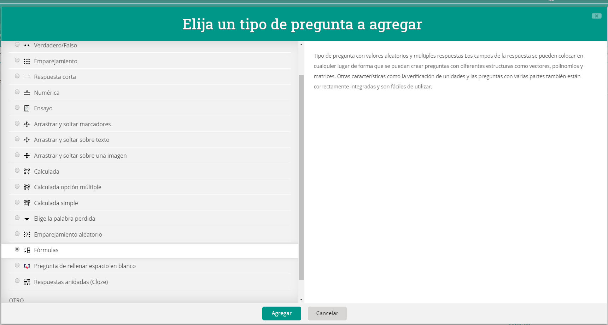

# On commence


CETTE DOCUMENTATION A ÉTÉ RÉALISÉE PENDANT L'ÉTÉ 2020 ET N'EST PAS À JOUR



Actuellement :

* Cela peut ne pas fonctionner correctement.
* Il peut y avoir d'autres moyens plus simples de faire ce qui est exposé ici.


## Que peut-on trouver sur cette page ?

Expériences d'utilisation de Moodle pour la création et l'évaluation d'activités mathématiques.

Ce livret se veut un guide non exhaustif pour la création de matériel d'auto-évaluation en mathématiques pour Moodle.

## Que vous faut-il ?

Une installation de Moodle et du plugin Moodle Formulas sera nécessaire.

Ce plugin peut être trouvé sur [https://moodle.org/plugins/qtype\_formulas](https://moodle.org/plugins/qtype\_formulas).

L'installation de plugins dans Moodle nécessite des autorisations d'administrateur. Les utilisateurs individuels **ne peuvent pas installer** de plugins. Assurez-vous que votre administrateur l'a installé ou demandez son installation.

Vous pouvez vérifier si vous avez le type de question Formulas si vous créez une nouvelle question et que l'option Formulas apparaît dans les types de questions que vous pouvez sélectionner :

## A qui s'adresse-t-elle ?

En tant que professeur de mathématiques au collège et au lycée, je me concentrerai sur des exemples et des questions adaptés au niveau auquel j'enseigne.

Cependant, la méthode de travail et les propositions d'activités seront suffisamment générales pour pouvoir être utilisées dans un cours Moodle de tout niveau. Les questions de type Formulas conviennent aussi bien aux mathématiques qu'à tout domaine dans lequel il peut être intéressant d'utiliser des questions utilisant des notations mathématiques ou susceptibles d'être générées par des valeurs aléatoires.


L'élaboration de ce type de questions est coûteuse en temps et en connaissances : il faut surmonter une courbe d'apprentissage et être résilient pour ne pas abandonner.



El tiempo que se invierte en la preparación de la pregunta se recupera con la corrección automática.



La pregunta que recibirá cada alumno será diferente a la del resto, lo que dificulta la copia.



Este libro no pretende ser un banco de preguntas ni un catálogo directamente aplicable al aula. Únicamente es una guía para facilitar el aprendizaje del uso de las preguntas de tipo fórmulas en Moodle.


> #### Largo es el camino de la enseñanza por medio de teorías, breve y eficaz por medio de ejemplos (Séneca)

## ¿Qué tipos de pregunta se pueden realizar con Fórmulas?

En este vídeo (en inglés) se observan varios de ejemplos de pregunta. También se puede ver algo del código que es necesario escribir para llegar al resultado que se muestra.



Además de las mostradas en el vídeo, que son las más sencillas de realizar, también es posible incluir preguntas que:

* Tengan elementos de opción múltiple:



.png>)



.png>)



* Generen gráficos dinámicamente: por ejemplo, la gráfica de una función.



.png>)



.png>)



.png>)



* Generen gráficos que permitan respuestas gráficas por parte del alumnado: por ejemplo, del tipo "arrastra los puntos para que la recta que los une sea y=mx+n", con m y n diferentes para cada alumno.



.png>)



.png>)



.png>)



## ¿Qué hacer cuando las cosas no funcionan?

En los momentos de atasco, en que una pregunta no funciona y no sabemos qué ocurre. Todo parece estar bien escrito, el código es el correcto, pero da error o no funciona como debiera.

Has buscado y leído la documentación, has buscado ejemplos parecidos, has hecho cursos gratuitos de Javascript y de HTML...

Puedes obtener ayuda en [el foro de Moodle quiz (en inglés)](https://moodle.org/mod/forum/view.php?id=737). Si es problema el idioma, puedes escribir en español y traducir con el traductor de Google. Se entenderá aunque no sea un inglés perfecto.

Es importante que documentes bien la pregunta:

* Incluye tu archivo XML.
* Explica bien qué quieres hacer, qué has hecho y qué problema encuentras.


No olvides que quien te trata de ayudar lo hace desinteresadamente y te está regalando su tiempo.



Evita preguntar por cosas que se encuentran haciendo una simple búsqueda en Google o que se han respondido anteriormente en el foro: usa el buscador primero.



Has preguntado y te han respondido: sé agradecido y comenta la respuesta. La persona que ha respondido merece saber si su respuesta ha sido útil.


## Garantía de que lo que digo es correcto y de que es la mejor forma de hacerlo

Ninguna.

Este documento únicamente pretende recoger cómo hago yo las cosas o cómo creo que se pueden hacer.

Por supuesto que no todo lo que diga aquí es correcto ni es la mejor forma de hacerlo. Simplemente es cómo considero yo hoy, con lo que sé del tema, que se pueden hacer ciertas cosas. Nada más.

Ofrezco la misma garantía que lo que cobro por hacer esto: CERO.
