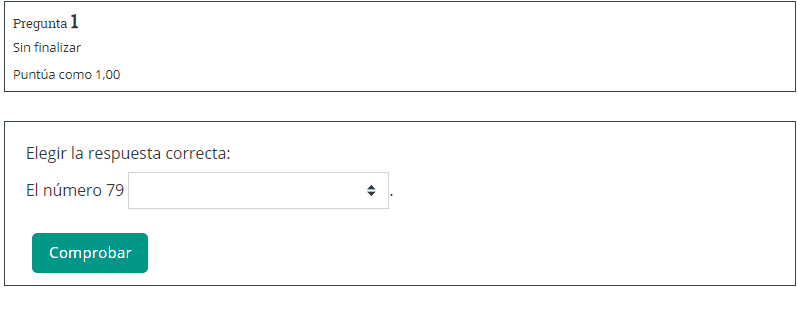

# Condicionales

## Archivo XML de referencia



## Enunciado

Se trata de hacer una pregunta que muestre un número natural aleatorio entre 1 y 100 y pregunte si es múltiplo de 2, 3, de ambos o de ninguno.



.png>)

.png>)

## ¿De qué tipo es la variable?


Dependiendo del tipo de variable con que estemos trabajando, los condicionales se harán de forma diferente.


### Número

Cuando tanto la condición a verificar como los valores a asignar a la variable son numéricos, podremos utilizar el **condicional ternario**.

Un ejemplo muy sencillo sería: si tenemos dos variables numéricas aleatorias **a** y **b**, y queremos que en caso de ser iguales **a** pase a valer el doble de **b**.

```
a=(a==b)?2*a:a;
```

En el ejemplo que nos ocupa, podemos comprobar si el número es múltiplo de 2, 3 y 6 mediante condicionales.


"Si número == múltiplo de 2 entonces multiplode2=1, si no multiplode2=0"

condición ? valor\_numérico\_si\_condición : valor\_numérico\_si\_no\_condición;



El signo = se usa para asignación de valores de variables.

El operador == se usa para ver si dos elementos son iguales.


Referencia del [condicional ternario](https://moodleformulas.org/course/view.php?id=32\&section=20). Ojo: **solamente funciona con números**.

Para ver si un número es par podemos usar la función [fmod()](https://moodleformulas.org/course/view.php?id=31\&section=30). fmod(x,y) devuelve el residuo de dividir x/y o, en otras palabras, x módulo y. También se podría haber usado el [operador %](https://moodleformulas.org/course/view.php?id=32\&section=11).

> La condición para que el número sea par es fmod(numero,2)==0.

```
esmultiplode2=(fmod(numero,2)==0)?1:0; #el valor de esmultiplode2 será 1 (cierto) si numero es par
```

Como las opciones de respuesta de la primera parte irán en una lista (al ser una pregunta de opción múltiple), buscamos la posición de cada respuesta en función de varias comprobaciones.

* Si es múltiplo de 2 y no lo es de 3, la solución será 0 (posición de "es múltiplo de 2" en la lista).
* Si es no es múltiplo de 2 y lo es de 3, la solución debe ser 1 (posición de "es múltiolo de 3" en la lista de opciones).
* Si es de ambos, la solución será 2.
* Si no es múltiplo de ninguno, la solución debe ser 3.

```
opciones=["es múltiplo de 2", "es múltiplo de 3", "es múltiplo de 2 y de 3", "no es múltiplo de 2 ni de 3"];
esmultiplode2=(fmod(numero,2)==0)?1:0;
esmultiplode3=(fmod(numero,3)==0)?1:0; 
esmultiplode6=(fmod(numero,6)==0)?1:0;
```

Con estas variables podemos asignar el valor de la solución mediante varios condicionales unos dentro de otros (todas las variables son numéricas).

```
solparte1=(esmultiplode6==1)?2:(esmultiplode2==1?0:(esmultiplode3==1?1:3));
```

>

.png>)

### Texto.

Condicionales mediante pick() referenciados en la página dedicada a [Fórmula algebraica](formula-algebraica.md#algunas-consideraciones).
