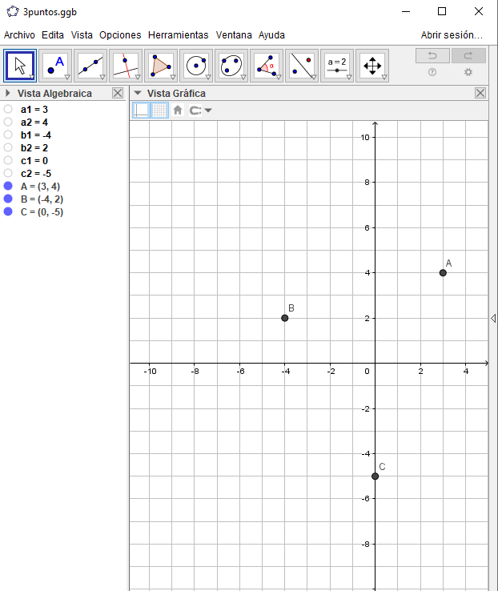

# Graphiques dynamiques avec GeoGebra

## Que voulons-nous faire ?

Il s'agit de montrer des graphiques GeoGebra générés en fonction de certaines variables (aléatoires ou non) établies dans la question Formulas.

Nous allons résoudre la même question que celle déjà posée dans les [graphiques dynamiques de JSXGraph](../consideraciones-antes-de-empezar-con-esto/graficos-dinamicos-de-jsxgraph.md).


En utilisant GeoGebra, nous n'aurons pas besoin de créer la construction graphique par programmation (en écrivant du code) : nous pouvons **créer les constructions directement depuis l'interface graphique** de GeoGebra ou réutiliser les constructions de[ www.geogebra.org](https://www.geogebra.org/).


.png>)

## Fichier XML de référence



## Fichier GeoGebra


Il sera pratique de le créer en se basant sur les **mêmes variables qui apparaissent dans la question Formulas** pour pouvoir passer facilement les valeurs entre la question Formulas et l'applet GeoGebra.




.png>)




Les points A, B et C ont été créés sur la base des paramètres : A=(a1,a2), ...


## Obtenir l'id du fichier GeoGebra


Le fichier peut être créé directement dans le cloud ou on peut travailler localement. Dans le premier cas, l'identifiant est obtenu directement à partir de l'adresse Web du navigateur.




L'identifiant est obtenu directement à partir de l'adresse Web du navigateur.

.png>)



Une fois le fichier créé, il est **exporté sous forme de page Web**.

.png>)

Cela télécharge le fichier sur le cloud et nous pouvons le trouver dans l'onglet Ressources.



## Comment ajuster la taille de l'applet

Il existe plusieurs options, il est pratique d'enregistrer le fichier avec la vue que l'on souhaite voir apparaître dans l'applet.

.png>)


Si nous masquons la vue algébrique et la barre de saisie, et faisons de la taille de la fenêtre ce que nous voulons que le graphique soit dans Moodle, la construction qui est téléchargée sur le cloud ne nécessite aucun autre ajustement.


## Approche générale

La stratégie que nous suivrons est :

1. Nous introduirons le graphe GeoGebra dans la question Formulas.
2. Nous modifierons les paramètres du graphique pour qu'ils soient ceux qui sont générés aléatoirement dans la question Formulas.

## Modèle de référence

Tout comme nous l'avons fait en réutilisant les activités d'auto-évaluation, nous utiliserons un modèle pour éviter d'avoir à écrire trop de code Javascript.

Dans ce cas, j'inclus la question en XML, qui peut être utilisée comme modèle.



## Adapter la question à d'autres fichiers GeoGebra


Ayant une question fonctionnelle, le plus confortable sera de l'adapter pour en créer de nouvelles.


```javascript
//ESTE SERÍA EL ENUNCIADO QUE SE MUESTRA SOBRE EL GRÁFICO
<p> A la vista del gráfico que se muestra: </p>

<script src="https://cdn.geogebra.org/apps/deployggb.js"></script>


<div id="ggbApplet"></div>

<script>

//Variables de dibujo del applet QUE HAY QUE EDITAR
  var a1={a1}; //Para no tener que poner llaves en el código del script
  var a2={a2};
  var b1={b1};
  var b2={b2};
  var c1={c1};
  var c2={c2};


var parameters = {
"id": "ggbApplet",
"width":612, //AQUÍ HAY QUE INTRODUCIR EL ANCHO DE LA CONSTRUCCIÓN
"height":608, //AQUÍ VA EL ALTO DE LA CONSTRUCCIÓN
"showMenuBar":false,
"showAlgebraInput":false,
"showToolBar":false,
"showToolBarHelp":false,
"showResetIcon":true,
"enableLabelDrags":false,
"enableShiftDragZoom":true,
"enableRightClick":false,
"errorDialogsActive":false,
"useBrowserForJS":false,
"allowStyleBar":false,
"preventFocus":true,
"showZoomButtons":true,
"capturingThreshold":3,
// add code here to run when the applet starts
"appletOnLoad":function(api){

              //Ajustamos los valores iniciales del dibujo COGIENDO LAS VARIABLES DE MOODLE
//Aquí podríamos ejecutar comandos en la construcción de GeoGebra
              api.setValue('a1',a1);
              api.setValue('a2',a2);
              api.setValue('b1',b1);
              api.setValue('b2',b2);
              api.setValue('c1',c1);
              api.setValue('c2',c2);

},
"showFullscreenButton":true,
"scale":1,
"disableAutoScale":false,
"autoHeight":true,
"allowUpscale":false,
"clickToLoad":false,
"appName":"classic",
"showSuggestionButtons":false,
"buttonRounding":1,
"buttonShadows":false,
"language":"es",
// si guardamos el archivo en la nube, aquí irá el material id
"material_id":"vbstt5ue", //AQUÍ HAY QUE INTRODUCIR EL ID DEL ARCHIVO GEOGEBRA
//"ggbBase64":"cambiar por base64",
};

var views = {'is3D': 0,'AV': 0,'SV': 0,'CV': 0,'EV2': 0,'CP': 0,'PC': 0,'DA': 0,'FI': 0,'macro': 0};
var applet = new GGBApplet(parameters, '5.0', views);

window.addEventListener("load", function() {
                    applet.inject('ggbApplet');
                    });

</script>

<br>
{#1}
{#2}
{#3}
```


En la función que se ejecuta en "AppletOnLoad", podemos ejecutar comandos de GeoGebra para adaptar la construcción a nuestro gusto.

La documentación de la API se encuentra en: [https://wiki.geogebra.org/en/Reference:GeoGebra\_Apps\_API](https://wiki.geogebra.org/en/Reference:GeoGebra\_Apps\_API)



Descripción de los parámetros de carga del applet en: [https://wiki.geogebra.org/en/Reference:GeoGebra\_App\_Parameters](https://wiki.geogebra.org/en/Reference:GeoGebra\_App\_Parameters)

