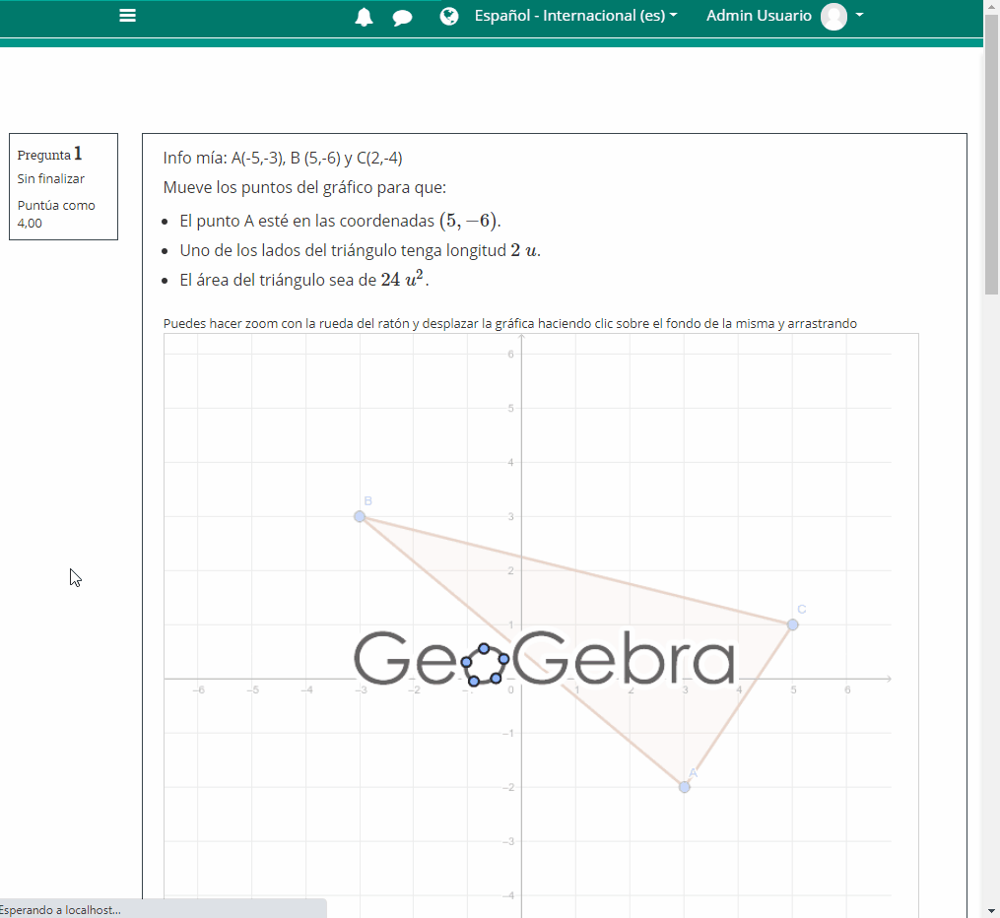

# Questions avec réponses graphiques avec GeoGebra

## Que voulons-nous faire ?

Nous voulons afficher une applet GeoGebra dans la question Moodle et capturer l'interaction de l'utilisateur avec le graphique.

Par exemple :

.png>)

Nous demandons à l'utilisateur de déplacer les points de sorte que :

* Un point se trouve a des coordonnées données (elles changent à chaque fois que la question est exécutée).
* L'un des côtés du triangle qui en résulte a une longueur donnée (il change à chaque fois que la question est exécutée).
* Le triangle doit avoir une aire donnée (elle change à chaque exécution de la question).
* Vous devez indiquer le périmètre du triangle que vous avez tracé avec une erreur absolue de 2 unités.

## Stratégie à suivre

Nous allons intégrer l'applet GeoGebra comme nous l'avons fait dans la [section précédente](graficos-dinamicos-con-geogebra.md).

Puisque nous devons maintenant **sauvegarder et récupérer la construction** que l'utilisateur a faite, nous stockerons les valeurs des variables qui définissent la réponse **dans autant de placeholders que nécessaire**. Plus tard, **nous masquerons les** **placeholders** à l'aide de jQuery afin qu'ils ne soient pas visibles pour l'utilisateur.

Dans ce cas, nous allons stocker les coordonnées des trois points, nous aurons donc besoin de 6 placeholders (cases de réponse) pour stocker l'état de l'applet.

Chaque fois que nous chargeons la question (ou chargeons l'applet), nous vérifierons s'il y a des valeurs stockées à partir des réponses précédentes, pour dessiner le graphique avec les valeurs initiales ou avec celles précédemment données par l'utilisateur.


Une fois résolu comment transmettre les données de Moodle Formulas à GeoGebra et inversement, nous avons résolu le problème.



De plus, puisque nous pouvons récupérer la valeur de n'importe quelle variable GeoGebra stockée dans l'applet, **nous pouvons donc utiliser n'importe quelle fonction GeoGebra pour évaluer** le travail effectué dans l'applet.


## Aperçu de la question pendant le développement

Dans un aperçu de la question, sans masquer tous les placeholders que nous avons utilisés, nous aurions les éléments suivants :



.png>)

Bien qu'il ne soit pas difficile de calculer l'aire et les longueurs des côtés à partir des coordonnées, nous avons choisi de les calculer dans GeoGebra et de les importer directement dans Moodle. Cela simplifiera beaucoup la correction.

## Fichier XML de référence



## Code de la question

```javascript
//Tout ce qui porte le nom "esqueseoculta" sera masqué lors de l'exécution de la question
<p name="elqueseoculta">Mes informations : A({a1},{a2}), B ({b1},{b2}) et C({c1},{c2}) </p>
 
 
<p>Déplacez les points sur le graphique de sorte que :</p>
<ul>
<li>Le point A soit aux coordonnées \( ({d1},{d2}) \).</li>
<li>Un des côtés du triangle ait pour longueur \( {L}~u\).</li>
<li>L'aire du triangle soit \( {area}~u^2 \).</li>
</ul>
<small>Vous pouvez zoomer avec la molette de la souris ou déplacer le graphique en cliquant sur l'arrière-plan puis en le faisant glisser</small>

<script src="https://cdn.geogebra.org/apps/deployggb.js"></script>
<script type="text/javascript" src="https://code.jquery.com/jquery-3.1.0.min.js"></script>

<div id="ggbApplet"></div>

<script>
//Ce premier script va masquer tous les éléments html dont le nom est "elquesoculta"
$(document).ready(function(){
    jQuery ("*[name='elqueseoculta']").hide();
 });

</script>

<script>
//Pour reprendre la valeur précédente si la question a déjà été répondue
//Il est également utilisé pour initialiser la construction lors de la première exécution.
function compruebaRespuesta(part,placeholder,variable){
    var resp=jQuery( "input[name*='_"+part.toString()+"_"+placeholder.toString()+"']" ).val();
    if (resp=="") {return variable;}
   else {return parseFloat(resp);}
}

//Variables du dessin de l'applet. Elles correspondent aux variables définies dans Moodle
var a1={a1}; var a2={a2};
var b1={b1}; var b2={b2};
var c1={c1}; var c2={c2};


var parameters = {
"id": "ggbApplet",
"width":700,
"height":600,
"showMenuBar":false,
"showAlgebraInput":false,
"showToolBar":false,
"showToolBarHelp":false,
"showResetIcon":true,
"enableLabelDrags":false,
"enableShiftDragZoom":true,
"enableRightClick":false,
"errorDialogsActive":false,
"useBrowserForJS":false,
"allowStyleBar":false,
"preventFocus":false,
"showZoomButtons":false,
"capturingThreshold":3,
// ajouter ici du code à exécuter au démarrage de l'applet
"appletOnLoad":function(api){

              //On ajuste les valeurs initiales du dessin

              api.setValue('a1',compruebaRespuesta(0,0,a1));
//Définissez a1 sur la valeur  placeholder 0=partie1, 0 = premier placeholder de la partie ou,
//s'il est vide, définissez sur a1 (variable aléatoire Moodle) -
//il aurait été plus facile de ne pas randomiser le graphique en incluant directement
//api.setValue('a1',compruebaRespuesta(0,0,3)); et la coordonnée x de A commencerait toujours
//à la valeur 3 si elle n'a pas été déplacée auparavant par l'utilisateur

              api.setValue('a2',compruebaRespuesta(0,1,a2));
              api.setValue('b1',compruebaRespuesta(1,0,b1));
              api.setValue('b2',compruebaRespuesta(1,1,b2));
              api.setValue('c1',compruebaRespuesta(1,2,c1));
              api.setValue('c2',compruebaRespuesta(1,3,c2));          

              //Función para vincular los parámetros del applet con las cajas de respuesta de Aules _(nº de parte de la pregunta -1)_nº de placeholder

              function updateListener(objName) { 
 //estas órdenes son las que pasan los valores del applet a los placeholder
                                
                              jQuery( "input[name*='_0_0']" ).val(api.getValue('a1'));
                              jQuery( "input[name*='_0_1']" ).val(api.getValue('a2'));
                              jQuery( "input[name*='_1_0']" ).val(api.getValue('b1'));
                              jQuery( "input[name*='_1_1']" ).val(api.getValue('b2'));                              
                              jQuery( "input[name*='_1_2']" ).val(api.getValue('c1'));
//_1_2 corresponde a la parte 2(=1+1), tercer placeholder de dicha parte(el primero tiene
//índice cero). Ahí almacenamos la variable c1 del applet.   
                              jQuery( "input[name*='_1_3']" ).val(api.getValue('c2'));
                              jQuery( "input[name*='_1_4']" ).val(api.getValue('a'));
                              jQuery( "input[name*='_1_5']" ).val(api.getValue('b'));
                              jQuery( "input[name*='_1_6']" ).val(api.getValue('c'));
                              jQuery( "input[name*='_2_0']" ).val(api.getValue('t1'));
                              jQuery( "input[name*='_3_1']" ).val(api.getValue('peri'));
                                   
}
              api.registerUpdateListener(updateListener);
},
"showFullscreenButton":true,
"scale":1,
"disableAutoScale":true,
"autoHeight":true,
"allowUpscale":false,
"clickToLoad":false,
"appName":"classic",
"showSuggestionButtons":false,
"buttonRounding":1,
"buttonShadows":false,
"language":"es",
// si nous sauvegardons le fichier dans le cloud, l'id du matériau ira ici.
"material_id":"p6tbqcav",
//"ggbBase64":"changer pour base64",
};

var views = {'is3D': 0,'AV': 0,'SV': 0,'CV': 0,'EV2': 0,'CP': 0,'PC': 0,'DA': 0,'FI': 0,'macro': 0};
var applet = new GGBApplet(parameters, '5.0', views);

window.addEventListener("load", function() {
                    applet.inject('ggbApplet');
                    });

</script>

<br>
{#1}
{#2}
{#3}
{#4}
```

## Ocultar los placeholder


Bastará con asignarles name="elqueseoculta" en cualquier etiqueta \<html>.

En este caso se ha hecho en un párrafo, aunque podría ser con \<span>, \<div>...


.png>)


En la última parte se ha ocultado un placeholder (que hemos utilizado para "recoger" el valor del perímetro del triángulo del applet) y se ha dejado otro para el usuario:


.png>)

## Corregir la respuesta

En la primera parte basta comparar el valor de las dos coordenadas del punto A con el valor conocido de la respuesta dado por las variables d1 y d2.


En la parte 2 necesitamos 7 placeholders por lo que la respuesta correcta deben ser 7 números.



No es lo más correcto, pero como **vamos a corregir utilizando criterios de calificación**, en esta pregunta no nos hemos preocupado en buscar analíticamente las coordenadas de los puntos que son solución de la actividad.



Si pulsamos en "Rellenar con las respuestas correctas" y comprobamos, obtendremos una respuesta errónea ya que no hemos establecido una respuesta correcta de ejemplo en el campo de Respuesta\*.



La respuesta dada será correcta si \_4 (longitud de BC) es igual a L (longitud que hemos pedido para uno de los lados en el enunciado) o si \_5 (longitud de AC) es igual a L o si \_6 lo es.


.png>)
