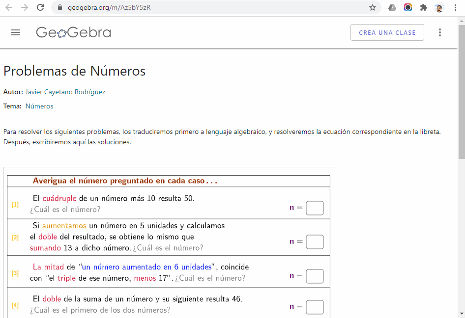
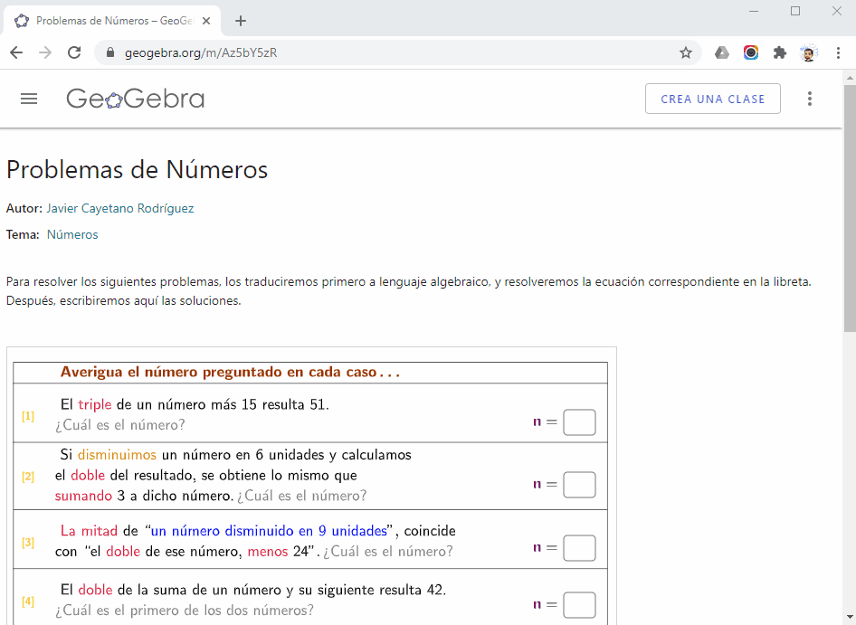
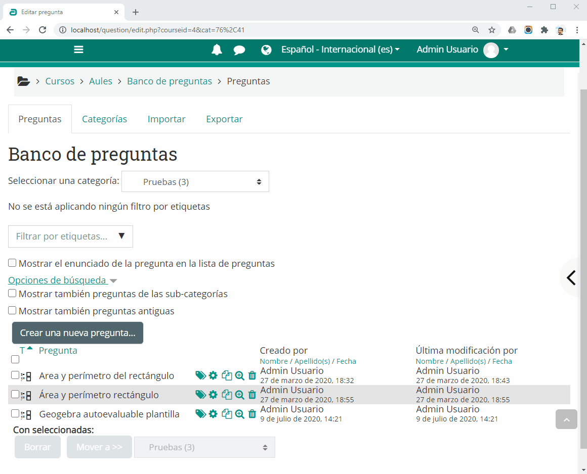

# Reutilización de actividades autoevaluables

## ¿Cuáles son estas actividades?

Son construcciones de GeoGebra que se han elaborado de forma que calculan una puntuación y se pueden integrar en una actividad SCORM.


Deben incluir las variables:

* **SCORMMaxScore**: que registra la puntuación máxima de la actividad.
* **SCORMRawScore**: que registra la puntuación obtenida por el alumno.


En la página de GeoGebra se encuentran múltiples ejemplos de estas actividades. Un magnífico ejemplo son las de [Javier Cayetano](https://www.geogebra.org/u/javier+cayetano).

## Ventajas de introducir estas actividades como pregunta de Aules y no como SCORM.

Este tipo de actividades se pueden incluir en Aules como actividad SCORM a través de **ExELearning:** [enlace a vídeo explicativo](https://youtu.be/1F9pFOCnZAY).&#x20;

Al introducir una **actividad como paquete SCORM**:

* es muy sencillo mediante ExELearning
* aparece en la página principal del curso
* se genera un ítem de calificación en el cuaderno de calificaciones
* únicamente se puede introducir (que yo sepa) una actividad autoevaluable en cada paquete SCORM

.png>)

Al introducir una **actividad como pregunta de Fórmulas**:

* no requiere programas externos
* es "algo más" complicado
* se puede incluir en el **banco de preguntas**, por lo que se puede clasificar fácilmente
* se puede incluir en **cuestionarios**
* ocupa **mucho menos espacio de almacenamiento** en el curso (hay un límite de tamaño del curso para restaurarlo posteriormente)
* si incluye aleatoriedad, **es posible almacenar la respuesta del usuario** (aunque dependiendo de cómo esté programada la actividad puede ser complicado) y no únicamente la calificación obtenida

## ¿Qué queremos hacer?

Vamos a introducir en un curso de Aules una pregunta de Fórmulas que incluya la [siguiente actividad autoevaluable de Problemas de Números](https://www.geogebra.org/m/Az5bY5zR) (autor Javier Cayetano Rodríguez).

.png>)

## Plantilla de pregunta: Archivo XML

Utilizaremos la siguiente pregunta como **plantilla** para importar la actividad autoevaluable.



## Breve explicación sobre su funcionamiento (no necesario entender)


El editor de Moodle debe estar en texto plano o puede que se "estropee" el código de la pregunta.


1. A través de la biblioteca [jQuery](https://jquery.com), capturamos el valor de la calificación de la actividad (variable SCORMRawScore) y lo pasamos al placeholder {\_0} de la Parte 1: utilizamos un Listener que se ejecuta con el applet de GeoGebra.
2. Ocultamos todos los elementos con name='elqueseoculta'. En este caso el único que hay es el placeholder {\_0} de la parte 1.
3. Establecemos un criterio de corrección para la parte 1 de modo que la puntuación de la pregunta corresponda con el valor de {\_0} en tanto por uno.

```javascript
<p> Aquí podrían copiarse las instrucciones que consideremos oportunas.</p>
<br>

<script src="https://cdn.geogebra.org/apps/deployggb.js"></script>
<script type="text/javascript" src="https://code.jquery.com/jquery-3.1.0.min.js"></script>

<div id="ggbApplet"></div>

<script>

//Este primer script oculará todos los elementos html cuyo nombre sea "elquesoculta"
$(document).ready(function(){
    jQuery ("*[name='elqueseoculta']").hide();
 });

</script>

<script>

//Para tomar el valor anterior si es que la pregunta ya se ha contestado, no se usa en esta pregunta
function compruebaRespuesta(part,placeholder,variable){
    var resp=jQuery( "input[name*='_"+part.toString()+"_"+placeholder.toString()+"']" ).val();
    if (resp=="") {return variable;}
   else {return parseFloat(resp);}
}


var parameters = {
"id": "ggbApplet",
"width":800,
"height":547,
"showMenuBar":false,
"showAlgebraInput":false,
"showToolBar":false,
"showToolBarHelp":false,
"showResetIcon":true,
"enableLabelDrags":false,
"enableShiftDragZoom":false,
"enableRightClick":false,
"errorDialogsActive":false,
"useBrowserForJS":false,
"allowStyleBar":false,
"preventFocus":false,
"showZoomButtons":false,
"capturingThreshold":3,
// add code here to run when the applet starts
"appletOnLoad":function(api){
                  function updateListener(objName) {                                     
                              jQuery( "input[name*='_0_0']" ).val(api.getValue('SCORMRawScore'));
                              
                                                                
}
              api.registerUpdateListener(updateListener);
            
},
"showFullscreenButton":true,
"scale":1,
"disableAutoScale":true,
"autoHeight":true,
"allowUpscale":false,
"clickToLoad":false,
"appName":"classic",
"showSuggestionButtons":false,
"buttonRounding":1,
"buttonShadows":false,
"language":"es",
// si guardamos el archivo en la nube, aquí irá el material id
"material_id":"b5ckap8z",
//"ggbBase64":"cambiar por base64",
};

var views = {'is3D': 0,'AV': 0,'SV': 0,'CV': 0,'EV2': 0,'CP': 0,'PC': 0,'DA': 0,'FI': 0,'macro': 0};
var applet = new GGBApplet(parameters, '5.0', views);

window.addEventListener("load", function() {
                    applet.inject('ggbApplet');
                    });

</script>

<br>
{#1}
```

Referencia de los **parámetros** que se aplican al cargar la construcción de GeoGebra: [PARÁMETROS](https://wiki.geogebra.org/en/Reference:GeoGebra\_App\_Parameters).

Referencia del **API** de GeoGebra: [API](https://wiki.geogebra.org/en/Reference:GeoGebra\_Apps\_API).

## Adaptar una pregunta a nuestra plantilla


El **editor de Moodle debe estar en texto plano** o puede que se "estropee" el código de la pregunta.


Necesitaremos varios parámetros, que son los que vamos a incluir en el código de la plantilla:

* [x] Comprobar que la actividad **guarda la puntuación en SCORMRawScore**: abrimos la actividad con GeoGebra y vemos que está la variable en la pregunta.



* [x] **Código de la actividad** de GeoGebra: está en la dirección web de la pregunta. En este caso es Az5bY5zR.

.png>)

* [x] **Tamaño del Applet**: en este caso es de 675 pixeles de ancho (width) y 417 de alto (height).




Con la edición de estos tres parámetros en la pregunta suministrada como plantilla, tendremos lista la pregunta autoevaluable de GeoGebra.




## Archivos adjuntos

Se incluye a continuación la actividad como pregunta de Fórmulas y como paquete SCORM. Obsérvese la diferencia de tamaño entre uno y el otro formato: con lo que ocupa esta pregunta en SCORM, podemos más de 40 preguntas en formato de Fórmulas.





