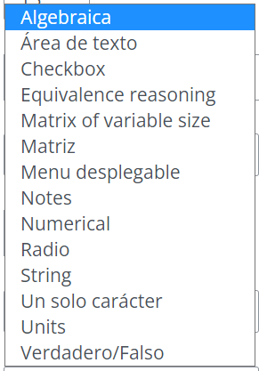

# Mi primera pregunta STACK

## Archivo xml


Comprimido en .rar y en formato xml de Moodle


## Descripción de la pregunta

Se trata de preparar una pregunta muy sencilla en que se pida calcular el área de una estancia rectangular (puede ser una cocina, un comedor, una habitación o una terraza).

* Las dimensiones deben estar entre 5 y 10 metros.
* De momento, no pediremos unidades en la respuesta del usuario.
* En el enunciado, se mostrarán, por un lado, las dimensiones en formato $$\LaTeX$$ y por otro como texto sin formato.

## Explicación paso a paso de la pregunta

### Variables

.png>)


Uno de los puntos fuertes de las preguntas STACK es la posibilidad de **aleatorización**.&#x20;

En [esta página](https://github.com/maths/moodle-qtype\_stack/blob/master/doc/en/CAS/Random.md) están las funciones que tenemos disponibles para aleatorizar.


En este caso hemos utilizado la función `rand(lista)` para elegir aleatoriamente un elemento de la lista y la función `rand_with_step(límite inferior, límite superior, paso)` para elegir un número que esté entre 5 y 10 (ambos incluidos) y avanzando de  uno en uno.

Los caracteres especiales (o con tilde en "habitación") se deben escribir como:

.png>)

Como última variable hemos elegido tans1 ("teacher answer 1") que almacena el valor de la respuesta correcta a la pregunta.


En las preguntas de ejemplo (que están en el [curso demostración de STACK](https://github.com/maths/moodle-qtype\_stack/blob/master/samplequestions/STACK-demo.mbz), que se puede descargar y restaurar en cualquier instalación de Moodle) se suele utilizar TANS para la respuesta del profesor.

En caso de que usemos preguntas previamente preparadas para elaborar nuevas preguntas, puede ahorrar tiempo utilizar variables con nombres genéricos para las respuestas finales ya que, en la comprobación de la respuesta y en el feedback, se utilizará varias veces la "respuesta correcta".


### Enunciado

.png>)


Para escribir variables en el enunciado podemos utilizar:

* `{#nombre_variable#}` mostrará el valor de la variable como texto sin formato. Si la variable es una cadena de texto, la mostrará como texto plano entre comillas.
* `{@nombre_variable@}` mostrará el valor de la variable como código $$\LaTeX$$. Si la variable es una cadena de texto, la mostrará como texto plano sin las comillas.



**MUY IMPORTANTE**

Cada ver que queramos incluir un **campo de respuesta** (hueco para que el usuario pueda responder), habremos de introducir **SIEMPRE LOS DOS**:

* `[[input:nombre_campo]]` donde queramos que aparezca el campo de respuesta
* `[[validation:nombre_campo]]` donde queramos que aparezca la validación de la respuesta. Notar que se trata de una validación del formato de la respuesta (decimal / no decimal, numérica, expresión algebraica...)

Donde queramos que aparezca la **corrección** de la validez de la respuesta del usuario (generalmente comparando con la respuesta correcta) tendremos que introducir:

* `[[feedback:nombre_feedback]]`



Téngase en cuenta que:

* Podremos incluir más de un campo de **feedback** para un campo de respuesta (input).
* Podrá haber campos de respuesta sin **feedback**.
* Podrá haber un único **feedback** para varios campos de respuesta.


.png>)

### Notas de la pregunta

En las preguntas que incluyen **aleatoriedad**, Moodle STACK nos pedirá que rellenemos el campo notas de la pregunta para poder guardar la pregunta.

La nota de la pregunta debe ser un texto que sea **diferente para cada una de las variantes de la pregunta**. STACK considerará que dos preguntas son la misma si sus notas de la pregunta son iguales.


Es conveniente definir **notas de la pregunta que nos ayuden a identificar fácilmente a qué variante de cada pregunta corresponden** ya que, cuando despleguemos las variantes de cada pregunta, la forma de identificarlas será a través de la nota de la pregunta.


.png>)


Las notas de la pregunta tendrán que incluir algunas de las variables aleatorizadas que hemos utilizado.


### Características del campo de entrada

.png>)


Por **cada uno de los inputs** que tengamos en la pregunta, tendremos una pestaña **Entrada** para configurar dicho campo de entrada.


Veamos cómo configurar los campos más importantes:

* **Tipo de entrada**: permite elegir el tipo de entrada que esperamos del usuario. Documentación detallada [aquí](https://github.com/maths/moodle-qtype\_stack/blob/master/doc/en/Authoring/Inputs.md). \
  Las que utilizaremos habitualmente son:

1. Algebraica: admite expresiones algebraicas formadas por números y variables. Aunque no esperemos variables, es también válida para números.
2. Numerical: únicamente serán válidas las respuestas numéricas. También admite operaciones entre números cuyo resultado sea un número. Puede configurarse para admitir determinados tipos de número y no operaciones. Documentación detallada [aquí](https://github.com/maths/moodle-qtype\_stack/blob/master/doc/en/Authoring/Numerical\_input.md).

* **Respuesta modelo**: aquí incluiremos una posible respuesta correcta a la pregunta. Es el valor que se introduce como respuesta correcta al pulsar en el botón `Rellenar con las respuestas correctas` de la vista previa de la pregunta. NO ES EL VALOR QUE SE UTILIZA PARA DECIDIR SI ES CORRECTA O NO LA RESPUESTA DEL USUARIO.
* **Prohibir flotantes**: en caso de que esté marcado como Sí, la respuesta del usuario no podrá incluir decimales de coma flotante (números decimales) y únicamente serán válidas respuestas con **números fraccionarios**. MUY ÚTIL EN MATEMÁTICA ELEMENTAL EN QUE NO DESEAMOS RESULTADOS DECIMALES.
* **Requerir mínima expresión**: fuerza a que las fracciones estén simplificadas. En caso contrario, da un aviso de que deben estarlo. EN LUGAR DE UTILIZAR ESTA OPCIÓN, NORMALMENTE SERÁ PREFERIBLE EVALUAR LA SIMPLIFICACIÓN CUANDO PUNTUEMOS LA PREGUNTA.
* **Comprobar tipo**: en caso de estar activado, muestra un mensaje de error al usuario en caso de que la expresión introducida no sea del tipo esperado y definido en el tipo de variable que sea la Respuesta modelo.
* **Verificar respuesta** y **Mostrar validación**: permiten mostrar al usuario su respuesta en un formato habitual. Por ejemplo, las fracciones, potencias y raíces se muestran de la forma estándar. NORMALMENTE, LA VALIDACIÓN COMPACTA SERÁ LA QUE MÁS SE UTILICE YA QUE SE MUESTRA EN LA MISMA LÍNEA DE LA RESPUESTA Y ES BASTANTE MÁS SENCILLA.

.png>)

.png>)

### Árbol de respuestas potenciales

La documentación relativa a esta parte de la pregunta se puede encontrar [aquí](https://github.com/maths/moodle-qtype\_stack/blob/master/doc/en/Authoring/Feedback.md).

.png>)


Aquí será donde:

* Haremos todas las comprobaciones que deseemos a la respuesta del usuario.
* Asignaremos la puntuación que consideremos dependiendo del resultado de dichas comprobaciones.
* Ofreceremos retroalimentación al usuario dependiendo del resultado de las comprobaciones que hagamos.&#x20;


En nuestra pregunta, únicamente verificamos que la respuesta del usuario(`Sans` que en este caso hemos llamado `ans1`) sea algebraicamente equivalente a la respuesta correcta (`Tans` que en este caso hemos llamado `tans1`). En caso de que así sea, que se asigna el 100% de la puntuación (1) y en caso contrario, se asigna una puntuación de cero. No ofrecemos retroalimentación.

Un campo importante a configurar es **PRT Feedback Style** ya que determinará qué información se ofrece al usuario tras la corrección. De momento lo dejaremos en Standard. Veremos más adelante, en otras preguntas, qué tipos de feedback podemos utilizar.

### Resultado de la pregunta

.png>)

### Despliegue de variantes y tests

.png>)


Cuando las preguntas incluyen aleatoriedad, Moodle ofrece la posibilidad (y encarecidamente recomienda) la generación de **variantes**, que son cada una de las versiones de la pregunta que se mostrarán a los alumnos.


El despliegue de variantes nos permitirá tener **control sobre la aleatoriedad** que se genera en las preguntas ya que podremos eliminar aquellas variantes cuya combinación de variables aleatorias no sea de nuestro agrado (valores que se repiten, resultados fraccionarios indeseados...).

.png>)

En nuestra pregunta hay potencialmente 4 tipos de estancia por 5 anchos diferentes por 5 largos diferentes, lo que da un total de 100 variantes distintas. Nosotros desplegaremos 30.

.png>)

Aquí podremos eliminar las variantes que no nos "gusten" haciendo click en la Papelera.

Para terminar la pregunta, únicamente nos faltará generar un **caso de prueba**.


Los **casos de prueba** sirven para identificar variantes que no funcionan correctamente.


En este caso, generaremos un caso de prueba elemental en que se verifique que si la respuesta del usuario (ans1) es igual a la respuesta modelo (tans1) se asigne una puntuación del 100% del valor de la pregunta.

.png>)

Con esto, en la pantalla en que se observan las variantes desplegadas, se puede realizar el test a todas las variantes (Run all tests on deployed variants):

.png>)
