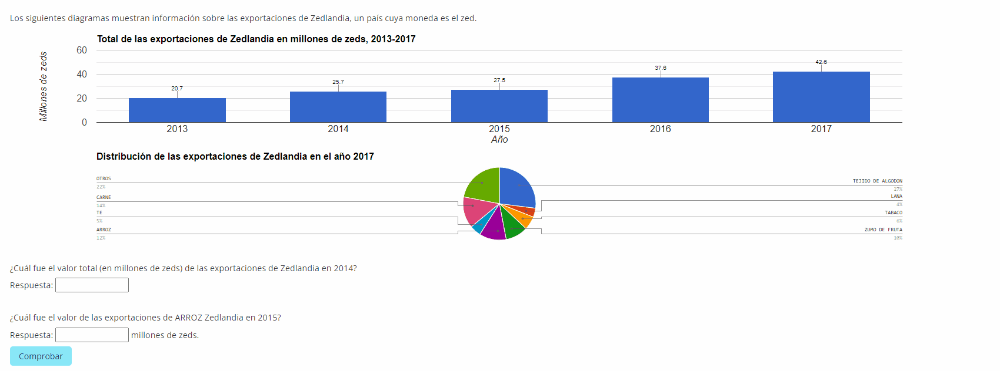
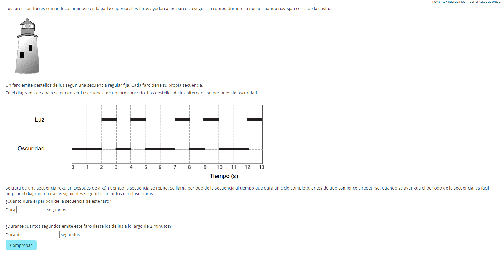
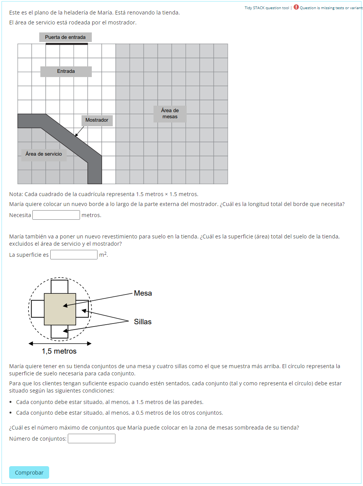

# Preguntas liberadas de PISA en Matemáticas

## Referencias

En [http://educalab.es/inee/evaluaciones-internacionales/preguntas-liberadas-pisa-piaac/preguntas-pisa-matematicas](http://educalab.es/inee/evaluaciones-internacionales/preguntas-liberadas-pisa-piaac/preguntas-pisa-matematicas) podemos encontrar las preguntas de las PRUEBAS PISA que se han publicado hasta la fecha (agosto de 2022).

En el anterior enlace se encuentran clasificadas por temática.

En el apartado de [recursos y enlaces](http://educalab.es/inee/evaluaciones-internacionales/preguntas-liberadas-pisa-piaac/enlaces), hay abundante información del diseño de las pruebas, qué pretenden evaluar y análisis de los resultados obtenidos.

## ¿Qué he hecho con las preguntas?

En total he adaptado cerca de 70 preguntas para que puedan ser utilizadas en cuestionarios de Moodle.


Es necesario tener instalado el tipo de **pregunta STACK**


Para la adaptación:

* He generado, en muchos casos, aleatoriedad en la pregunta: para que la pregunta sea diferente cada vez.
* He modificado, en algunos casos, la forma en que se responde: cambiando de opción múltiple a casilla de entrada.
* He incluido nuevos apartados o eliminado apartados existentes en los casos en que me ha parecido oportuno.
* Las preguntas de PISA 2003, están identificadas como PISA 2003 en el nombre de pregunta.


El nombre de las preguntas en el archivo xml es el mismo que aparece en la página de EDUCALAB, para poder relacionarlas fácilmente.


## Algunos ejemplos

Algunas capturas de pantalla de preguntas para que os hagáis una idea de cómo son.


Si hacéis click sobre las imágenes, podéis verlas con mejor calidad.


.gif>)

## Archivo xml con las preguntas

Basta descomprimir el archivo, crear una categoría en el banco de preguntas e importar ahí las preguntas en Moodle.&#x20;


Preguntas en formato **xml de Moodle**.



Es necesario tener instalado el tipo de [**pregunta STACK**](https://github.com/maths/moodle-qtype\_stack/blob/master/doc/en/About/index.md)****



