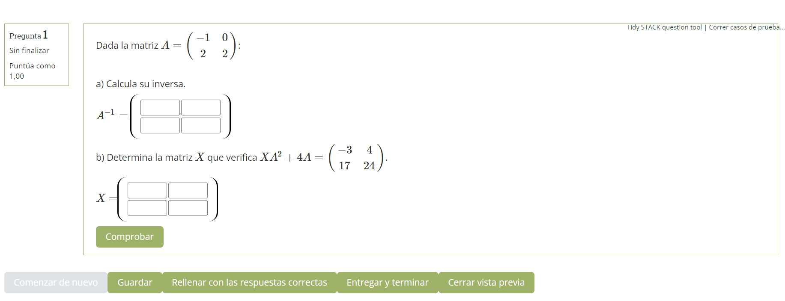

# Álgebra matricial

## Archivo XML


Descomprimir el .rar. Preguntas en formato XML de Moodle


## ¿Qué contiene el archivo?

Son 18 preguntas AUTOCORRECTIVAS y ALEATORIZADAS (cada vez que se ejecuta la pregunta, cambia el enunciado), de las que han aparecido en la PAU en MATEMÁTICAS APLICADAS A LAS CIENCIAS SOCIALES II de la Comunidad Valenciana en los últimos años.


Es **necesario tener instalado el tipo de pregunta STACK** en curso de Moodle en que se utilicen.



Funcionan en el Moodle de la Comunidad Valenciana (AULES).


## ¿Cómo funcionan?

Las preguntas califican globalmente la matriz, con lo que no asignan puntuaciones intermedias en caso de que haya algunos elementos correctos y otros incorrectos.


En caso de ser la respuesta incorrecta, se indica al usuario **qué elementos de la matriz son los incorrectos**.


